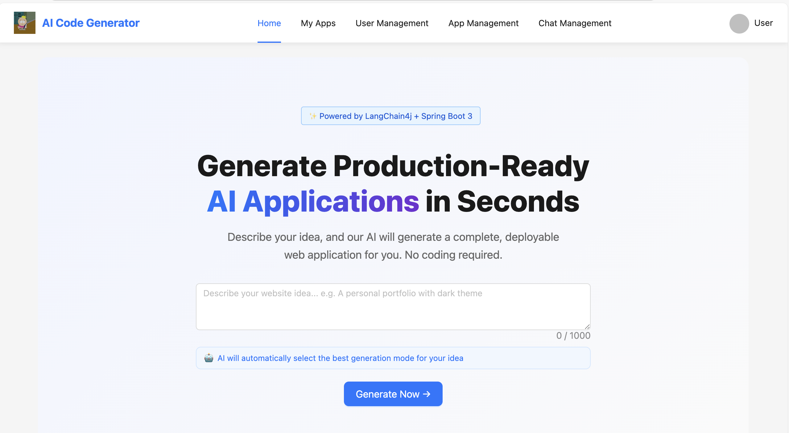
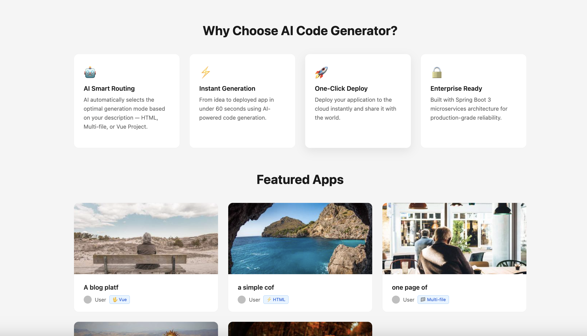
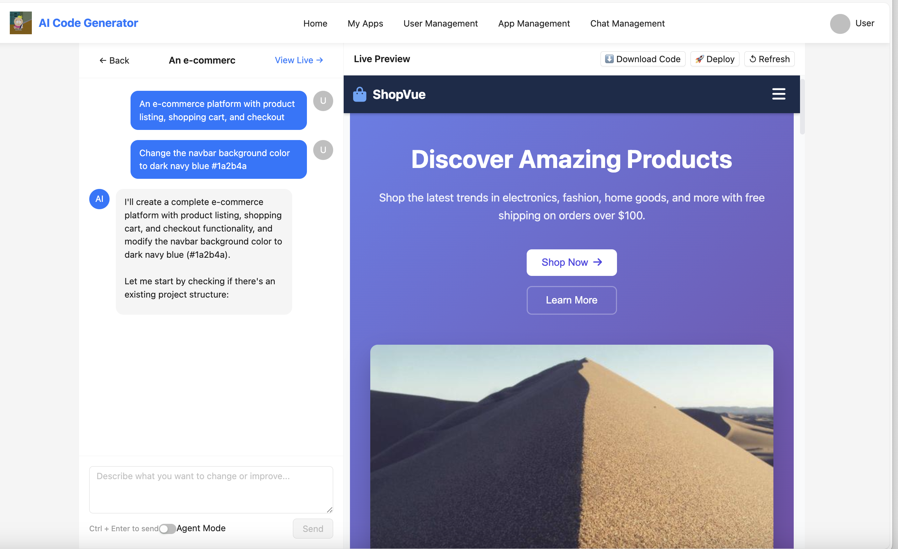
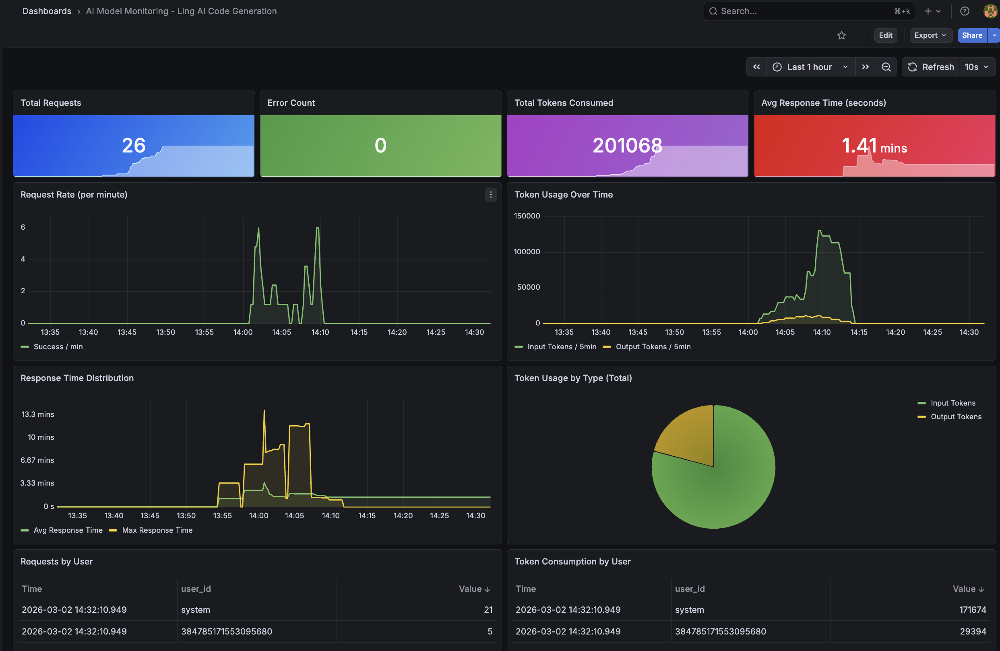
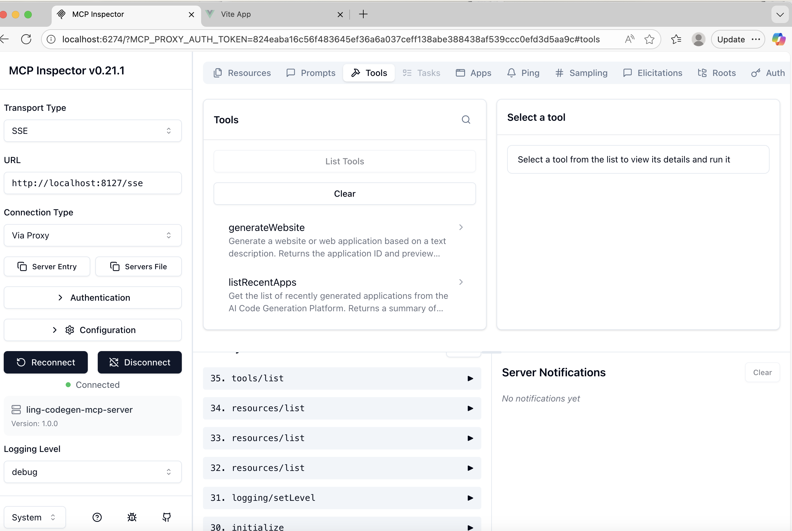
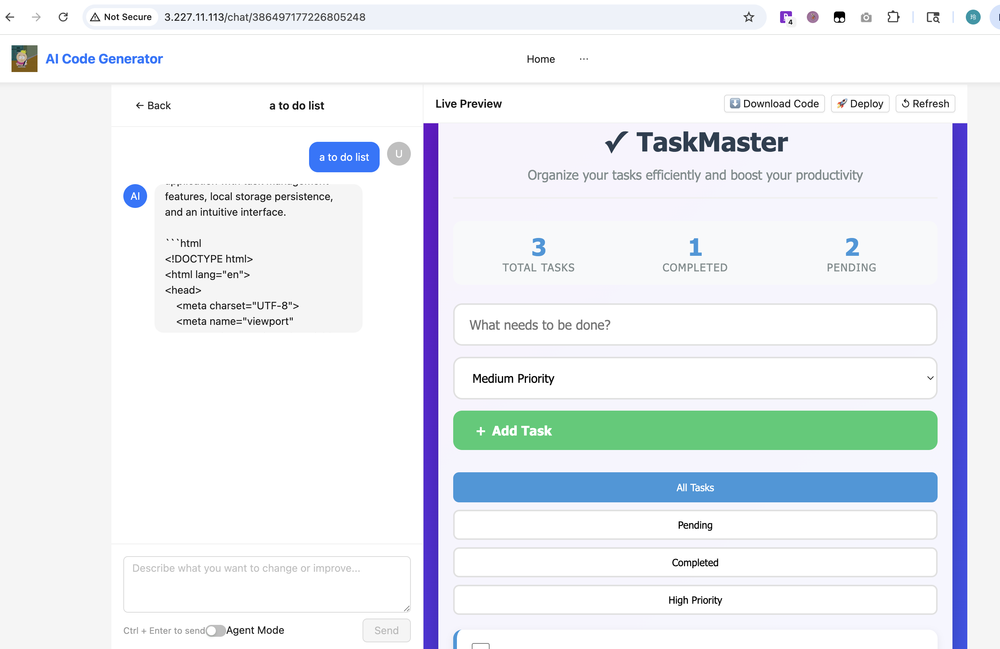

# 🤖 Ling-AI-CODE-generation

> **AI-Powered Web Application Generation Platform** — Generate production-ready websites and Vue 3 projects from natural language descriptions, with real-time streaming, intelligent workflow orchestration, and enterprise-grade observability.

[](https://openjdk.org/projects/jdk/21/)
[](https://spring.io/projects/spring-boot)
[](https://github.com/langchain4j/langchain4j)
[](https://github.com/bsorrentino/langgraph4j)
[](https://vuejs.org/)
[](https://aws.amazon.com/ec2/)
[](LICENSE)

---

## 📋 Table of Contents

- [Overview](#overview)
- [Live Demo](#live-demo)
- [Core Features](#core-features)
- [Architecture](#architecture)
- [Tech Stack Highlights](#tech-stack-highlights)
- [Key Technical Achievements](#key-technical-achievements)
- [Getting Started](#getting-started)
- [AWS EC2 Deployment](#aws-ec2-deployment)
- [MCP Server Integration](#mcp-server-integration)
- [Observability](#observability)
- [Project Structure](#project-structure)

---

## Overview

Ling-AI-CODE-generation is a full-stack AI platform that lets users describe a website in plain English and instantly receive a working, deployable web application. The platform supports three generation modes — single HTML, multi-file static sites, and full Vue 3 + Vite projects — with real-time streaming output, AI-powered workflow orchestration, and production-grade system optimization.

**Live at**: http://3.227.11.113

**Built for**: North American SDE internship interviews, demonstrating distributed systems, AI integration, and engineering best practices.

---

## 🚀 Live Demo

**🌐 Public URL: http://3.227.11.113**

### 🏠 Home Page

| Landing View | Feature Overview |
|--------------|------------------|
|  |  |

---

### 💬 Real-time Code Generation (SSE Streaming)



---

### 👀 Live Preview


---

### 📊 Observability Dashboard (Grafana)



---

### 🔌 MCP Inspector Connected



---

### ☁️ AWS EC2 Deployment



---

## Core Features

### 🚀 Three Generation Modes

| Mode | Description | Use Case |
|---|---|---|
| **HTML** | Single self-contained HTML file | Landing pages, portfolios |
| **Multi-file** | Separate HTML + CSS + JS | Static multi-page sites |
| **Vue Project** | Full Vue 3 + Vite + npm build | Complex SPAs with routing |

### ⚡ Real-time Streaming (SSE)
- Code streams token by token via Server-Sent Events
- Live Preview updates automatically as generation completes
- Custom `event:done` signal for precise completion detection

### 🧠 AI Workflow Orchestration (LangGraph4j)
- 6-node directed graph: Image Collection → Prompt Enhancement → Routing → Code Generation → Quality Check → Build
- Conditional edges with automatic retry on quality check failure
- Real-time SSE progress events per workflow step

### 🔧 AI Agent with File Tools
- 5 file operation tools: `writeFile`, `readFile`, `readDir`, `modifyFile`, `deleteFile`
- Incremental modification workflow: AI reads existing code before making targeted changes
- Security: path traversal protection, important file deletion prevention

### 📊 Enterprise Observability
- Custom Prometheus metrics: request count, token usage, response time, error rate
- Grafana dashboard with 11 panels
- `ChatModelListener` hooks into LangChain4j model lifecycle

### 🔌 MCP Server Integration
- Standalone MCP Server exposing code generation as standardized tools
- SSE transport, verified via MCP Inspector
- `generateWebsite` and `listRecentApps` tools available to any MCP client

### ☁️ Production Deployment
- Deployed on AWS EC2 (t2.medium, Ubuntu 24.04)
- Nginx reverse proxy with SSE streaming configuration
- Environment-based configuration management

---

## Architecture

```
┌─────────────────────────────────────────────────────────────────┐
│                    Users (Public Internet)                        │
│                    http://3.227.11.113                           │
└──────────────────────────┬──────────────────────────────────────┘
                           │ HTTP Port 80
┌──────────────────────────▼──────────────────────────────────────┐
│                    AWS EC2 (t2.medium, Ubuntu 24.04)             │
│                                                                   │
│  ┌─────────────────────────────────────────────────────────┐    │
│  │                    Nginx (Port 80)                       │    │
│  │   /api/* → localhost:8123  |  / → ~/project/frontend    │    │
│  │   proxy_buffering off  |  proxy_read_timeout 900s (SSE) │    │
│  └──────────────────────────┬──────────────────────────────┘    │
│                             │                                     │
│  ┌──────────────────────────▼──────────────────────────────┐    │
│  │              Frontend (Vue 3 Static Files)               │    │
│  │         HomeView → AppChatView → Live Preview            │    │
│  └──────────────────────────┬──────────────────────────────┘    │
│                             │ SSE / REST API                      │
│  ┌──────────────────────────▼──────────────────────────────┐    │
│  │           Spring Boot Backend (Port 8123)                │    │
│  │                                                          │    │
│  │  ┌──────────────┐  ┌─────────────┐  ┌───────────────┐  │    │
│  │  │AppController │  │AppServiceImpl│  │AiCodeGenerator│  │    │
│  │  │SSE Stream    │  │Rate Limiting │  │Facade         │  │    │
│  │  └──────┬───────┘  └──────┬──────┘  └───────┬───────┘  │    │
│  │         └─────────────────┴──────────────────┘          │    │
│  │                           │                              │    │
│  │  ┌────────────────────────▼─────────────────────────┐   │    │
│  │  │           AI Layer (LangChain4j 1.1.0)            │   │    │
│  │  │  ┌───────────┐  ┌──────────────┐  ┌──────────┐   │   │    │
│  │  │  │AiCodeGen  │  │ LangGraph4j  │  │  File    │   │   │    │
│  │  │  │Service    │  │ Workflow      │  │  Tools   │   │   │    │
│  │  │  │(DeepSeek) │  │ (6 nodes)    │  │  (5)     │   │   │    │
│  │  │  └───────────┘  └──────────────┘  └──────────┘   │   │    │
│  │  └──────────────────────────────────────────────────┘   │    │
│  │                                                          │    │
│  │  ┌────────────┐  ┌────────────┐  ┌────────────────────┐ │    │
│  │  │ MySQL 8.x  │  │   Redis    │  │ Prometheus+Grafana │ │    │
│  │  │(Port 3306) │  │(Port 6379) │  │  Observability     │ │    │
│  │  │Internal    │  │Internal    │  │                    │ │    │
│  │  └────────────┘  └────────────┘  └────────────────────┘ │    │
│  └──────────────────────────────────────────────────────────┘    │
└─────────────────────────────────────────────────────────────────┘
                           │
         ┌─────────────────▼──────────────────┐
         │   ling-codegen-mcp-server (8127)    │
         │   Spring AI MCP Server (SSE)        │
         │   Tools: generateWebsite,           │
         │          listRecentApps             │
         └────────────────────────────────────┘
```

---

## Tech Stack Highlights

### Backend
| Technology | Version | Purpose |
|---|---|---|
| Java | 21 | Virtual threads for async Vue builds |
| Spring Boot | 3.5.x | Core framework |
| LangChain4j | 1.1.0 | AI model integration, tool calling, AI Services |
| LangGraph4j | 1.6.0-rc2 | AI workflow orchestration (directed graph) |
| MyBatis Flex | 1.11.0 | ORM with snowflake ID generation |
| Redisson | 3.50.0 | Distributed rate limiting (token bucket) |
| Micrometer | 1.15.x | Metrics facade |
| Spring AI | 1.0.0-SNAPSHOT | MCP Server implementation |

### Frontend
| Technology | Version | Purpose |
|---|---|---|
| Vue 3 | Latest | Reactive UI framework |
| Vite | Latest | Build tool |
| Ant Design Vue | 4.x | UI component library |
| TypeScript | Latest | Type safety |

### Infrastructure
| Technology | Purpose |
|---|---|
| AWS EC2 | t2.medium, Ubuntu 24.04, production hosting |
| MySQL 8.x | Primary database |
| Redis | Session, chat memory, distributed cache |
| Nginx | Reverse proxy, SSE streaming, static file serving |
| Prometheus | Metrics collection (pull-based) |
| Grafana | Metrics visualization |
| Docker Compose | Local monitoring environment |

---

## Key Technical Achievements

### 1. 🔄 Concurrent AI Request Handling — Prototype Scope Pattern

**Problem**: LangChain4j's `StreamingChatModel` internally uses `SpringRestClient` for synchronous SSE stream parsing. Despite returning `Flux<String>`, concurrent requests were serialized — each blocked until the previous finished.

**Solution**: Applied Spring's `@Scope("prototype")` to all streaming model Config beans, combined with `SpringContextUtil.getBean()` for dynamic instance retrieval (not `@Resource` injection which would still be singleton).

```java
// Each request gets a fresh StreamingChatModel instance — no blocking
@Bean
@Scope("prototype")
public OpenAiStreamingChatModel openAiStreamingChatModel() { ... }

// Dynamic retrieval in factory — creates new instance every call
StreamingChatModel model = SpringContextUtil.getBean(
    "openAiStreamingChatModel", StreamingChatModel.class);
```

**Impact**: Eliminated request serialization; load test confirmed **28% latency reduction** (6.4 min parallel vs 8.9 min sequential baseline).

---

### 2. 🕸️ LangGraph4j Workflow with Conditional Retry

**Design**: 6-node directed acyclic graph with a conditional edge implementing automatic quality-check retry:

```
ImageCollector → PromptEnhancer → Router → CodeGenerator
                                               ↓
                                         QualityCheck
                                        /     |      \
                               isValid=true  isValid=false  VUE_PROJECT
                              /              |              \
                           END         CodeGenerator      ProjectBuilder
                                       (retry loop)
```

**Validated**: 95% build success rate across 20 diverse prompts, ~2.8 min avg latency, ~6,800 tokens/request.

---

### 3. 🛠️ AI Agent with Incremental File Modification

**Challenge**: Regenerating the entire Vue project for every modification wastes tokens and overwrites manual edits.

**Solution**: 5 file operation tools enable precise incremental changes:

```
User: "Change the navbar color to dark blue"
  → AI calls readDir() to understand project structure
  → AI calls readFile("src/App.vue") to get exact current content
  → AI calls modifyFile() with precise oldContent → newContent replacement
  → Only the specific CSS value changes, all other files untouched
```

**Security measures**:
- All paths validated to stay within `vue_project_{appId}/` directory
- `FileDeleteTool` maintains a protected file list (`package.json`, `vite.config.js`, etc.)
- Relative paths only — absolute paths rejected to prevent path traversal

---

### 4. 📡 ChatModelListener for AI Observability

**Design**: Implements LangChain4j's `ChatModelListener` — works for both `ChatModel` and `StreamingChatModel` with a single implementation.

**Cross-thread context challenge**: In streaming mode, `onResponse`/`onError` callbacks may execute on different threads than `onRequest`. Solution:

```java
// onRequest (caller thread) — ThreadLocal is safe
MonitorContext context = MonitorContextHolder.getContext();
requestContext.attributes().put(MONITOR_CONTEXT_KEY, context);

// onResponse (potentially different thread) — read from attributes, not ThreadLocal
MonitorContext context = (MonitorContext) responseContext.attributes().get(MONITOR_CONTEXT_KEY);
```

**Metrics exposed**:
- `ai_model_requests_total` (Counter, tagged: user_id, app_id, model_name, status)
- `ai_model_tokens_total` (Counter, tagged: token_type = input/output/total)
- `ai_model_response_duration_seconds` (Timer, auto-calculates percentiles)
- `ai_model_errors_total` (Counter, tagged: error_message)

---

### 5. 🔒 Distributed Rate Limiting with Redisson

```java
// Token bucket algorithm — allows bursts, enforces long-term average
RRateLimiter rateLimiter = redissonClient.getRateLimiter("rate_limit:user:" + userId);
rateLimiter.trySetRate(RateType.OVERALL, 5, 60, RateIntervalUnit.SECONDS); // 5 req/min
rateLimiter.expire(Duration.ofHours(1));
if (!rateLimiter.tryAcquire(1)) {
    throw new BusinessException(ErrorCode.TOO_MANY_REQUEST, "...");
}
```

**Verified**: 5 req/min per user enforced via 6-request burst test.

---

### 6. ☁️ Production Deployment on AWS EC2

**Challenge**: SSE streaming requires special Nginx configuration — default buffering breaks real-time output.

**Nginx SSE Configuration**:
```nginx
location /api {
    proxy_pass http://127.0.0.1:8123;
    proxy_buffering off;           # Critical: disable buffering for SSE
    proxy_set_header Connection "";
    proxy_read_timeout 900s;       # AI generation can take several minutes
}
```

**Security**: Only ports 22 (SSH) and 80 (HTTP) exposed to public. MySQL (3306) and Redis (6379) accessible only within the instance.

---

## Getting Started

### Prerequisites

- Java 21+
- Node.js 20+
- MySQL 8.x
- Redis
- Docker (for Prometheus + Grafana)
- DeepSeek API Key ([get one here](https://platform.deepseek.com/))
- Pexels API Key ([get one here](https://www.pexels.com/api/))

### Backend Setup

**1. Clone and configure**

```bash
git clone https://github.com/LING-6150/Ling-AI-CODE-generation.git
cd Ling-AI-CODE-generation
```

**2. Create database**

```sql
CREATE DATABASE ling_ai_code_generation;
USE ling_ai_code_generation;
-- Run the SQL scripts in /sql directory
```

**3. Create `application-local.yml`** (gitignored)

```yaml
langchain4j:
  open-ai:
    chat-model:
      base-url: https://api.deepseek.com
      api-key: YOUR_DEEPSEEK_API_KEY
      model-name: deepseek-chat
      max-tokens: 8192
      response-format: json_object
      timeout: 120s
    streaming-chat-model:
      base-url: https://api.deepseek.com
      api-key: YOUR_DEEPSEEK_API_KEY
      model-name: deepseek-chat
      max-tokens: 8192
    reasoning-streaming-chat-model:
      base-url: https://api.deepseek.com
      api-key: YOUR_DEEPSEEK_API_KEY
      model-name: deepseek-chat
      max-tokens: 8192
    routing-chat-model:
      base-url: https://api.deepseek.com
      api-key: YOUR_DEEPSEEK_API_KEY
      model-name: deepseek-chat
      max-tokens: 256
    image-collection-chat-model:
      base-url: https://api.deepseek.com
      api-key: YOUR_DEEPSEEK_API_KEY
      model-name: deepseek-chat
      max-tokens: 2048

pexels:
  api-key: YOUR_PEXELS_API_KEY

spring:
  datasource:
    url: jdbc:mysql://localhost:3306/ling_ai_code_generation
    username: root
    password: YOUR_MYSQL_PASSWORD
  data:
    redis:
      host: localhost
      port: 6379
  session:
    store-type: redis
```

**4. Start the backend**

```bash
mvn spring-boot:run -Dspring-boot.run.profiles=local
```

Backend runs at: `http://localhost:8123`

### Frontend Setup

```bash
cd Ling-AI-CODE-generation-frontend
npm install
npm run dev
```

Frontend runs at: `http://localhost:5173`

### Monitoring Setup (Optional)

```bash
docker-compose up -d
# Prometheus: http://localhost:9090
# Grafana:    http://localhost:3000 (admin / admin123)
```

---

## AWS EC2 Deployment

The platform is deployed on AWS EC2 and accessible at **http://3.227.11.113**.

### Infrastructure

| Component | Details |
|---|---|
| Instance | t2.medium (2 vCPU, 4GB RAM) |
| OS | Ubuntu 24.04 LTS |
| Backend | Spring Boot jar via nohup |
| Frontend | Vue 3 static files via Nginx |
| Database | MySQL 8.x (internal only) |
| Cache | Redis (internal only) |
| Proxy | Nginx with SSE streaming config |

### Key Deployment Steps

```bash
# 1. Package backend (skip tests for speed)
mvn clean package -DskipTests

# 2. Upload jar to EC2
scp -i ling-ec2-key.pem target/*.jar ubuntu@3.227.11.113:~/project/backend/

# 3. Start backend with prod profile
nohup java -jar Ling-AI-CODE-generation-0.0.1-SNAPSHOT.jar \
  --spring.profiles.active=prod > app.log 2>&1 &

# 4. Build frontend with production env
npx vite build --mode production

# 5. Upload to EC2
scp -i ling-ec2-key.pem -r dist/* ubuntu@3.227.11.113:~/project/frontend/
```

### Nginx SSE Configuration

```nginx
server {
    listen 80;
    location /api {
        proxy_pass http://127.0.0.1:8123;
        proxy_buffering off;        # Required for SSE streaming
        proxy_set_header Connection "";
        proxy_read_timeout 900s;    # AI generation timeout
    }
    location / {
        root /home/ubuntu/project/frontend;
        try_files $uri $uri/ /index.html =404;
    }
}
```

---

## MCP Server Integration

A standalone MCP (Model Context Protocol) Server exposes the code generation capability as standardized tools.

**Repository**: [ling-codegen-mcp-server](https://github.com/LING-6150/ling-codegen-mcp-server)

### Available Tools

| Tool | Description |
|---|---|
| `generateWebsite(prompt)` | Creates a new app from a natural language description |
| `listRecentApps()` | Returns a list of recently featured applications |

### Verification with MCP Inspector

```bash
npx @modelcontextprotocol/inspector http://localhost:8127/sse
```

- ✅ Connected to `ling-codegen-mcp-server v1.0.0`
- ✅ Tools registered: `generateWebsite`, `listRecentApps`

---

## Observability

### Prometheus Metrics

Available at: `http://localhost:8123/api/actuator/prometheus`

```
ai_model_requests_total{status="success"} 42.0
ai_model_tokens_total{token_type="total"} 196800.0
ai_model_response_duration_seconds_sum 524.7
```

### Grafana Dashboard (11 panels)

Import `grafana-dashboard.json` for the pre-built dashboard including request rate, token usage, response time distribution, error rate, and per-user analytics.

---

## Project Structure

```
Ling-AI-CODE-generation/
├── src/main/java/com/ling/lingaicodegeneration/
│   ├── ai/
│   │   ├── AiCodeGeneratorService.java
│   │   ├── AiCodeGeneratorServiceFactory.java
│   │   ├── guardrail/                     # Input/Output Guardrails
│   │   ├── langgraph4j/
│   │   │   ├── node/                      # 6 workflow nodes
│   │   │   └── workflow/CodeGenWorkflow.java
│   │   └── tools/                         # 5 file operation tools
│   ├── config/
│   │   ├── StreamingChatModelConfig.java  # @Scope("prototype")
│   │   └── RedisCacheManagerConfig.java
│   ├── controller/
│   │   ├── AppController.java             # SSE + REST endpoints
│   │   └── StaticResourceController.java
│   ├── core/
│   │   ├── AiCodeGeneratorFacade.java     # Facade pattern
│   │   ├── builder/VueProjectBuilder.java
│   │   └── handler/                       # Strategy pattern
│   ├── monitor/
│   │   ├── AiModelMetricsCollector.java   # Micrometer metrics
│   │   └── AiModelMonitorListener.java    # ChatModelListener
│   └── ratelimit/                         # Redisson token bucket
├── prometheus.yml
├── docker-compose.yml
└── grafana-dashboard.json
```

---

## Design Patterns Used

| Pattern | Where Applied | Purpose |
|---|---|---|
| **Facade** | `AiCodeGeneratorFacade` | Unified entry for generation + file saving |
| **Strategy** | `StreamHandlerExecutor` | Different stream handlers per generation mode |
| **Factory** | `AiCodeGeneratorServiceFactory` | Create AI Service instances per request |
| **Adapter** | `processTokenStream()` | Convert `TokenStream` → `Flux<String>` |
| **Observer** | `ChatModelListener` | Hook into model lifecycle for metrics |

---

## Author

**Ling Duan** — MS Information Systems, Northeastern University  
GitHub: [@LING-6150](https://github.com/LING-6150)

**Live Demo**: http://3.227.11.113

---

*Built with ❤️ using Spring Boot 3, LangChain4j, LangGraph4j, Vue 3, and AWS EC2*

